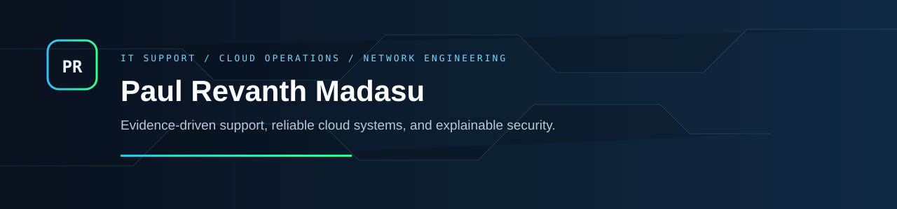

# Hello, I'm Paul Revanth Madasu

I am an Information Technology professional and M.S. candidate focused on IT support, cloud operations, networking, systems administration, and application support. My work emphasizes structured troubleshooting: reproduce the issue, preserve evidence, isolate the root cause, make the smallest safe change, verify recovery, and document the outcome.

I completed a Cloud Engineer internship at Infosys and build practical portfolio systems with Azure, Linux, TCP/IP/DNS, IAM, REST APIs, Python, Bash, Docker, Terraform, SQL, and JavaScript.

[LinkedIn](https://www.linkedin.com/in/madasu-paul-revanth-044896215/) · [Email](mailto:Paulrevanthpersonal@gmail.com) · Sedona, Arizona

## Featured IT engineering

### [CloudAtlas SupportOS](https://github.com/paulrevanthpersonal-lab/cloudatlas-supportos)

Working FastAPI and SQLite support-operations platform with an enterprise Kanban workspace, incident timeline, SLA analytics, searchable SOP library, typed REST API, tests, Docker workflow, and CI.

### [Cloud Support Operations Lab](https://github.com/paulrevanthpersonal-lab/cloud-support-operations-lab)

Azure and Linux documentation lab with a reviewable topology, expandable runbooks, safe diagnostic tooling, redacted evidence with checksums, Terraform, troubleshooting log, and competency map.

### [SentinelCore Zero Trust](https://github.com/paulrevanthpersonal-lab/sentinelcore-zero-trust)

Graduate capstone reference platform aligned with NIST SP 800-207, including demo authentication, modeled executive posture, controlled attack simulations, policy artifacts, KQL detections, incident playbooks, and automated control validation.

## Original web-technology builds

- **[Aster & Loom Storefront](https://github.com/paulrevanthpersonal-lab/atelier-storefront)** — editorial commerce evolved from my original storefront coursework, with product views, persistent cart, mocked checkout, original artwork, and tests.
- **[FreshMart Commerce](https://github.com/paulrevanthpersonal-lab/freshmart-commerce)** — accessible grocery cart evolved from my original FreshMart application, with testable pricing rules, persisted quantities, promotions, and transparent totals.
- **[Lights Out Studio](https://github.com/paulrevanthpersonal-lab/lights-out-studio)** — replayable puzzle evolved from my original final project, with solvable generation, difficulty, timer, hints, best scores, and tested rules.
- **[Wildpath Adventure](https://github.com/paulrevanthpersonal-lab/wildpath-adventure)** — branching narrative evolved from my original mid-term project, with a validated graph, resources, persistent state, multiple endings, and tests.

## Core toolkit

```text
Support & operations  Incident management · SLA · RCA · log analysis · SOPs · UAT
Cloud & DevOps        Azure · Docker · Terraform/IaC · GitHub Actions · CI/CD · Bash
Systems & network     Linux · TCP/IP · DNS · IAM · RBAC · MFA · Conditional Access
Software & data       Python · FastAPI · REST APIs · JavaScript · Node.js · SQL · MongoDB
```

## Certifications

- Microsoft Certified: Azure AI Fundamentals — issued January 2024
- Microsoft Certified: Azure Fundamentals — issued November 2022
- Microsoft Certified: Azure Developer Associate — issued March 2023, expired March 2025
- Parallel, Concurrent, and Distributed Programming in Java Specialization — Rice University, October 2023

## How I build

Every featured repository includes a substantial README, clear implementation boundaries, architecture or design notes, automated checks, desktop/mobile screenshots, an interview guide, and reproducible local instructions. Modeled data and reference implementations are labeled so reviewers can distinguish working code from live production deployment.

## Current direction

I am seeking IT Support, Cloud Support, Cloud Operations, Network Support, Systems Administration, Application Support, and junior Cloud/DevOps opportunities where disciplined diagnosis and clear communication matter.
